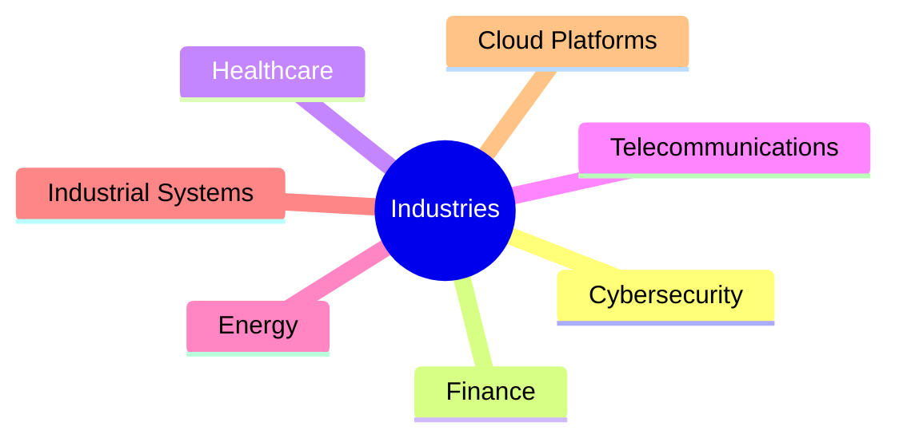

# Hey, I'm Ramiro 👋

```bash
Platform Engineer | DevOps | Kubernetes | Distributed Systems | Multi-Cloud
```

I build and operate cloud-native platforms focused on scalability, resiliency, automation, and production reliability.

Most of my work lives at the intersection of:

- ☁️ Cloud Architecture
- ⚙️ Platform Engineering
- ☸️ Kubernetes
- 🌍 Distributed Systems
- 🔐 Security & DevSecOps
- 📈 Observability & Reliability
- 🌐 Networking
- 🤖 Infrastructure Automation

---

## 🚀 Current Focus

Right now I’m heavily involved in:

- Modernizing legacy infrastructure into cloud-native platforms
- Building active-active multi-region Kubernetes environments
- Scaling distributed systems across AWS & Azure
- Improving observability and operational maturity
- Performance optimization & FinOps
- Designing resilient production infrastructure

---

# 🧠 Engineering Philosophy

> “Infrastructure should scale with the business, not with operational pain.”

I care deeply about:

- operational simplicity
- resilient architectures
- automation-first approaches
- production-grade observability
- scalable delivery pipelines
- systems that survive real-world failure conditions

---

# ⚡ Core Technologies

| Area | Stack |
|---|---|
| **Cloud** | AWS · Azure · GCP |
| **Containers** | Kubernetes · Docker · Helm |
| **IaC** | Terraform · CloudFormation |
| **CI/CD** | GitHub Actions · GitLab CI · ArgoCD |
| **Observability** | Prometheus · Grafana · ELK |
| **Networking** | VPN · SDN · Load Balancers · WAF |
| **Security** | IAM · Zero Trust · DevSecOps |
| **Systems** | Linux · Distributed Systems · SRE |

---

# 📊 What I Usually Work On

```text
Kubernetes Platform Engineering     ████████████████████
Cloud Infrastructure                ██████████████████
Automation & IaC                    █████████████████
Observability / SRE                 ███████████████
Networking                          ████████████
Security & DevSecOps                ███████████
Performance Optimization            ██████████
```

---

# 🏗️ Types of Projects I Enjoy

| Project Type | Examples |
|---|---|
| 🌍 Distributed Platforms | Multi-region Kubernetes, active-active systems |
| 🔄 Modernization | Legacy → Cloud-native migrations |
| 📦 Platform Engineering | Internal developer platforms, automation |
| 📈 Reliability | Observability, HA, resiliency engineering |
| 💸 FinOps | Cost optimization at scale |
| 🌐 Networking | Hybrid cloud, routing, enterprise infra |
| 🔐 Security | Secure delivery pipelines & hardened infra |

---

# 🔥 Things I’ve Worked With

<details>
<summary><b>☁️ Cloud & Infrastructure</b></summary>

- AWS
- Azure
- GCP
- Kubernetes
- Docker
- Terraform
- CloudFormation
- Helm
- ECS / EKS

</details>

<details>
<summary><b>⚙️ CI/CD & GitOps</b></summary>

- GitHub Actions
- GitLab CI
- ArgoCD
- CircleCI
- GitOps workflows
- Deployment automation

</details>

<details>
<summary><b>📈 Observability & Reliability</b></summary>

- Prometheus
- Grafana
- ELK Stack
- Logging pipelines
- Metrics engineering
- Incident troubleshooting
- Performance tuning

</details>

<details>
<summary><b>🌐 Networking & Security</b></summary>

- VPNs
- SDN
- Load Balancers
- WAF
- DNS
- Firewall management
- Zero Trust concepts
- Enterprise networking

</details>

---

# 🌎 Industries



---

# 🛠️ Outside Work

| Hobby | Description |
|---|---|
| 🧪 Home Lab | Kubernetes, self-hosting, networking |
| 🤖 AI Projects | Automation & experimentation |
| 🎮 Gaming | Mostly competitive & strategy |
| 🎵 Music / DJ | Electronic music production |

---

# 📫 Connect

- 💼 LinkedIn
- 🧑‍💻 GitHub
- ☁️ Always building something

---

```yaml
status:
  learning: always
  complexity_tolerance: high
  production_incidents: inevitable
  automation: preferred
  coffee_dependency: critical
```
